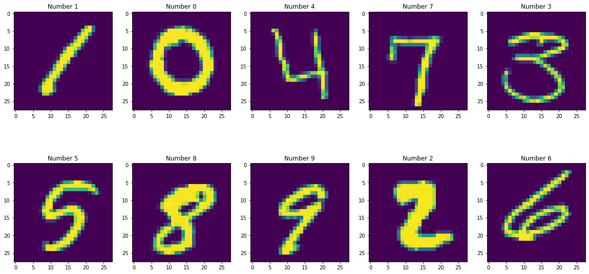

# MNIST-Digit

This project uses the MNIST Digit recognition data set from https://www.kaggle.com/c/digit-recognizer/data, focusing on decomposing applyig Discrete Cosine Transformation to each image to extract key characteristic of each of them, and apply Principal Component Analysis (PCA). After selecting the top Principal Components we procede to pre-process the new data set for modeling, performing standarization, feature ranking, feature selection, outlier removal, and cross-validation to build candidate models. The project implements Support Vector Machines, Random Forest and Feed Foward Neural Networks (FFNN).

* [DCT and PCA Decomposition](MNIST_Decomposition.ipynb)
* [Modeling](MNIST_Modeling.ipynb)

## Digits

## DCT

